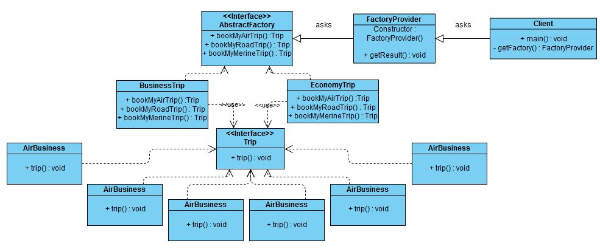

# Software Design Patterns

Let's learn all type of software design patterns and their importance.
Before that you must have a basic understaning of [ULM Diagram](UMLNotes.md)

## Introduction

Design pattern is a very important section of Software Engineering, which is a general and reusable solution to a commonly occurring problem within a given context in software design. Rather than a complete finish product to code, it is a concept or idea or template that we are using in different situations to solve different problems in the process of software design.

### Different Design Patterns

All design patterns are grouped into 3 groups

* #### Creational Design Pattern

    * This design patterns deals with object creation mechanisms, which mechanism is suitable for the situation. 
    * Used in scenarios when system should not be dependant on, 'how objects are created?'.
    * The basic object creation technique may complecate the design and create complexity for developers, where creational design patterns solve this problem by controlling the object creation process.
    * This design patterns allows you to reuse other people’s knowledge.
    * All Creational Design Patterns are based on two common ideas,
      * They encapsulate knowledge about which concrete class the system should use.
      * They hide, how instances of these concrete classes are created and combined.
    
* #### Structural Design Pattern

   * The Sructural Design Patterns ease the design by identifying a simple way to realize the relationship among entities.
   * Sructural Design Patterns are about organizing different classes and objects to form large structure and provide new functionalies without any change in the existing design structure.
   * Structural Design Patterns depends on two programming concepts, Inheritance and Interface to allow multiple classes and objects to work togather and form a single working structure.
    
* #### Behavioural Design Pattern

   * Behavioural Design Patterns are concerned with object interaction and responsibilities
   * The interaction between the objects should be in such a way that they can easily talk to each other and still should be loosely coupled.
   * The implemantation and the client should be loosely coupledin order to avoid avoid hard coding and dependencies.
   

| # | Creational Design Pattern | # | Structural Design Pattern | # | Behavioral Design Pattern |
| - | ------------------------- | - | ------------------------- | - | ------------------------- |
| 1 | [Factory Method * ](#factory-method) | 7 | [Adapter * ](#adapter) | 15 | [Chain of Responsibility](#chain-of-responsibility) |
| 2 | [Abstract Factory](#abstract-factory) | 8 | [Bridge](#bridge) | 16 | [Command](#command) |
| 3 | [Builder * ](#builder) | 9 | [Composite](#composite) | 17 | [Interpreter](#interpreter) |
| 4 | [Object Pool](#object-pool) | 10 | [Decorator](#decorator) | 18 | [Iterator](#iterator) |
| 5 | [Prototype](#prototype) | 11 | [Facade](#facade) | 19 | [Mediator](#mediator) |
| 6 | [Singleton * ](#singleton) | 12 | [Flyweight](#flyweight) | 20 | [Memento](#memento) |
|  |  | 13 | [Private Class Data](#private-class-data) | 21 | [Null Object](#null-object) |
|  |  | 14 | [Proxy](#proxy) | 22 | [Observer * ](#observer) |
|  |  |  |  |23 | [State * ](#state) |
|  |  |  |  |24 | [Strategy * ](#strategy) |
|  |  | | | 25 | [Template method](#tempate-method) |
|  |  | | | 26 | [Visitor](#visitor) |

(*) - Important Software Design Patterns


1. #### Factory Method

   * Factory method design pattern uses a factory method as an interface to create objects instead of using a direct instantiation of objects, using 'new' keyword.
   * Define an interface or abstract class for creating an object and let the subclass decide which class to instantiate.
   * Also known as virtual constructor.
   
   * **Advantages**
   
      * Allows the subclass to choose the type of object to create.
      * This promotes loose-coupling, i.e., objects are independent.
      * It eliminates the direct binding of application-specific classes to the code.
      * To achieve that, we use either an interface or an abstract class so that we can work with any class that is implementing this interface or abstract class.
      * We use this when a class doesn't know which subclass to instantiate.
      
   * **UML Diagram**
   
   <div align="center">
      <p>
         <div>
             
         </div>
      </p>
   </div>
   
   * **Code Implementation**
   
      _Step 1: Trip.java, a generic(general, common) Interface_

      ```java
      package com.common;

      public interface Trip {
         public void trip();
      }
      ```

      _Step 2: AirTrip.java, RoadTrip.java, MerineTrip.java, all concrete classes_
      
      *AirTrip.java*
      
      ```java
      package com.concreteClasses;

      import java.util.logging.Level;
      import java.util.logging.Logger;

      import com.common.Trip;

      public class AirTrip implements Trip{

         static Logger logger = Logger.getLogger(AirTrip.class.getSimpleName());
         @Override
         public void trip() {
              logger.log(Level.INFO, logger.toString());

         }

      }
      ```
         
      *RoadTrip.java*
      
      ```java
      package com.concreteClasses;

      import java.util.logging.Level;
      import java.util.logging.Logger;

      import com.common.Trip;

      public class RoadTrip implements Trip {

         static Logger logger = Logger.getLogger(RoadTrip.class.getSimpleName());
         @Override
         public void trip() {
              logger.log(Level.INFO, logger.toString());

         }

      }
      ```

      *MerineTrip.java*

      ```java
      package com.concreteClasses;

      import java.util.logging.Level;
      import java.util.logging.Logger;

      import com.common.Trip;

      public class MerineTrip implements Trip {

         static Logger logger = Logger.getLogger(MerineTrip.class.getSimpleName());
         @Override
         public void trip() {
              logger.log(Level.INFO, logger.toString());

         }

      }
      ```

      *Step 3: MakeMyTrip.java, Factory Class*

      ```java
      package com.factoryClass;

      import com.common.Trip;
      import com.concreteClasses.AirTrip;
      import com.concreteClasses.MerineTrip;
      import com.concreteClasses.RoadTrip;

      public class MakeMyTrip {

         public Trip factoryMethod(String way) {
            if("FLY".equalsIgnoreCase(way)) {
               return new AirTrip();
            } else if("RUN".equalsIgnoreCase(way)) {
               return new RoadTrip();
            } else if("SWIM".equalsIgnoreCase(way)) {
               return new MerineTrip();
            }
            return null;
         }
      }
      ```

      *Step 4: MyTrip.java, Client*

      ```java
      package com.client;

      import com.common.Trip;
      import com.factoryClass.MakeMyTrip;

      public class MyTrip {

         public static void main(String[] args) {

            //AirTrip Object
            MakeMyTrip mmt = new MakeMyTrip();
            Trip myTrip = mmt.factoryMethod("fly");
            myTrip.trip();

            //RoadTrip Object
            myTrip = mmt.factoryMethod("run");
            myTrip.trip();

            //MerineTrip Object
            myTrip = mmt.factoryMethod("swim");
            myTrip.trip();
         }

      }
      ```

2. #### Abstract Factory

   * Abstract Factory Design Pattern is almost similar to [Factory Method Design Pattern](#factory-method), but the fact is that its more like factory of factories.
   * Abstract Factory Design Pattern provides a way to encapsulate a group of individual factories ( factory - an object for creating other objects ) that have a common concern without specifying their concrete classes directly.
   * Factory Method Design Pattern holds only one factory class, which returns different types of objects based on the input provided, using either if-else or switch statement.
   * In Abstract Factory Design Pattern, we get rid of if-else and have a factory class for each subclass, and now these abstract factory class returns the subclass based on input factory class.
   * Abstract factory works aroung a super-factory which creates other factories. 
   * **Advantages**
   
      * Abstract Factory Design Pattern separates the client code from concrete implementation.
      * When the system is independent of how its object is created, composed, and presented.
      * When a family of related objects, has to be used together.
      * When you want to show a library of objects, without revealing the implementation, through a generic interface.
      * When the system wants to be configured with one of a multiple families of objects.
      
   * **UML Diagram**
   
   <div align="center">
      <p>
         <div>
             
         </div>
      </p>
   </div>
   
   * **Code Implementation**
   
   *Step 1 : Trip.java, Create a common interface for our products (this can be a Interface / a Abstract Class)*
   
   ```java
   package com.products.prod_Interface;

   public interface Trip {
      public void trip();

   }
   ```

   *Step 2 : Add all products, our concrete classes*
   
   *AirBusiness.java*
   
   ```java
   package com.products.prod_classes;

   import java.util.logging.Level;
   import java.util.logging.Logger;

   import com.products.prod_Interface.Trip;

   public class AirBusiness implements Trip{

      static Logger logger = Logger.getLogger(AirBusiness.class.getSimpleName());

      @Override
      public void trip() {
         logger.log(Level.INFO, "Yes, we are giving Airoplane service to the selected location, and business tickets are avoilable.");
      }

   }
   ```
   
   *AirEconomy.java*
   
   ```java
   package com.products.prod_classes;

   import java.util.logging.Level;
   import java.util.logging.Logger;

   import com.products.prod_Interface.Trip;

   public class AirEconomy implements Trip{

      static Logger logger = Logger.getLogger(AirEconomy.class.getSimpleName());

      @Override
      public void trip() {
         logger.log(Level.INFO, "Yes, we are giving Airoplane service to the selected location.");
      }

   }
   ```
   
   *MerineBusiness.java*
   
   ```java
   package com.products.prod_classes;

   import java.util.logging.Level;
   import java.util.logging.Logger;

   import com.products.prod_Interface.Trip;

   public class MerineBusiness implements Trip {

      static Logger logger = Logger.getLogger(MerineBusiness.class.getSimpleName());

      @Override
      public void trip() {
         logger.log(Level.INFO, "Yes, Fery service to mentioned location is available with the business class.");
      }

   }
   ```
   
   *MerineEconomy.java*
   
   ```java
   package com.products.prod_classes;

   import java.util.logging.Level;
   import java.util.logging.Logger;

   import com.products.prod_Interface.Trip;

   public class MerineEconomy implements Trip{

      static Logger logger = Logger.getLogger(MerineEconomy.class.getSimpleName());

      @Override
      public void trip() {
         logger.log(Level.INFO, "Yes, we are serving to the mentioned location. Please welcome.");
      }

   }
   ```
   
   *RoadBusiness.java*
   
   ```java
   package com.products.prod_classes;

   import java.util.logging.Level;
   import java.util.logging.Logger;

   import com.products.prod_Interface.Trip;

   public class RoadBusiness implements Trip {

      static Logger logger = Logger.getLogger(RoadBusiness.class.getSimpleName());

      @Override
      public void trip() {
         logger.log(Level.INFO, "Yes, Bus with Business class service to the mentioned location is available.");
      }

   }
   ```
   
   *RoadEconomy.java*
   
   ```java
   package com.products.prod_classes;

   import java.util.logging.Level;
   import java.util.logging.Logger;

   import com.products.prod_Interface.Trip;

   public class RoadEconomy implements Trip{

      static Logger logger = Logger.getLogger(RoadEconomy.class.getSimpleName());

      @Override
      public void trip() {
         logger.log(Level.INFO, "Yes, Bus service to mentioned location is available.");
      }

   }

   ```

   *Step 3 : Create Abstract Factory interface (this can be a Interface / a Abstract Class)*
   
   *AbstractFactory.java*
   
   ```java
   package com.abstractFactory;

   import com.products.prod_Interface.Trip;

   public interface AbstractFactory {

      public Trip bookMyAirTrip();
      public Trip bookMyRoadTrip();
      public Trip bookMyMerineTrip();

   }
   ```
   
   *Step 4 : Add concrete factory to create products*
   
   *BusinessTrip.java*
   
   ```java
   package com.concreteFactory;

   import com.abstractFactory.AbstractFactory;
   import com.products.prod_Interface.Trip;
   import com.products.prod_classes.AirBusiness;
   import com.products.prod_classes.MerineBusiness;
   import com.products.prod_classes.RoadBusiness;

   public class BusinessTrip implements AbstractFactory {

      @Override
      public Trip bookMyAirTrip() {
         return new AirBusiness();
      }

      @Override
      public Trip bookMyRoadTrip() {
         return new RoadBusiness();
      }

      @Override
      public Trip bookMyMerineTrip() {
         return new MerineBusiness();
      }

   }
   ```
   
   *EconomyTrip.java*
   
   ```java
   package com.concreteFactory;

   import com.abstractFactory.AbstractFactory;
   import com.products.prod_Interface.Trip;
   import com.products.prod_classes.AirEconomy;
   import com.products.prod_classes.MerineEconomy;
   import com.products.prod_classes.RoadEconomy;

   public class EconomyTrip implements AbstractFactory {

      @Override
      public Trip bookMyAirTrip() {
         return new AirEconomy();
      }

      @Override
      public Trip bookMyRoadTrip() {
         return new RoadEconomy();
      }

      @Override
      public Trip bookMyMerineTrip() {
         return new MerineEconomy();
      }

   }
   ```
   
   *Step 5 : Add constants in an Enum*
   
   ```java
   package com.enum_files;

   public enum BusinessType {
      BUSINESS,
      ECONOMY
   }
   ```
   
   *Step 5 : Add client side classes*
   
   *FactoryProvider.java*
   
   ```java
   package com.client;

   import com.abstractFactory.AbstractFactory;
   import com.products.prod_Interface.Trip;

   public class FactoryProvider {
      Trip airTrip;
      Trip roadTrip;
      Trip merineTrip;

      public FactoryProvider(AbstractFactory factory){
         airTrip = factory.bookMyAirTrip();
         roadTrip = factory.bookMyRoadTrip();
         merineTrip = factory.bookMyMerineTrip();
      }

      public void getResult() {
         airTrip.trip();
         roadTrip.trip();
         merineTrip.trip();
      }

   }
   ```
   
   *Client.java*
   
   ```java
   package com.client;

   import com.abstractFactory.AbstractFactory;
   import com.concreteFactory.BusinessTrip;
   import com.concreteFactory.EconomyTrip;
   import com.enum_files.BusinessType;

   public class Client {

      private static FactoryProvider getFactory(BusinessType businessType) {
         FactoryProvider fProvider = null;
         AbstractFactory factory;
         if(BusinessType.BUSINESS == businessType) {
             factory = new BusinessTrip();
             fProvider = new FactoryProvider(factory);
         }else if(BusinessType.ECONOMY == businessType) {
            factory = new EconomyTrip();
            fProvider = new FactoryProvider(factory);
         }

         return fProvider;
      }

      public static void main(String[] args) {
         FactoryProvider myFactory = getFactory(BusinessType.BUSINESS);
         myFactory.getResult();

         myFactory = getFactory(BusinessType.ECONOMY);
         myFactory.getResult();
      }

   }
   ```


3. #### Builder


4. #### Object Pool


5. #### Prototype


6. #### Singleton


7. #### Adapter


8. #### Bridge


9. #### Composite


10. #### Decorator


11. #### Facade


12. #### Flyweight


13. #### Private Class Data


14. #### Proxy


26. #### Visitor
