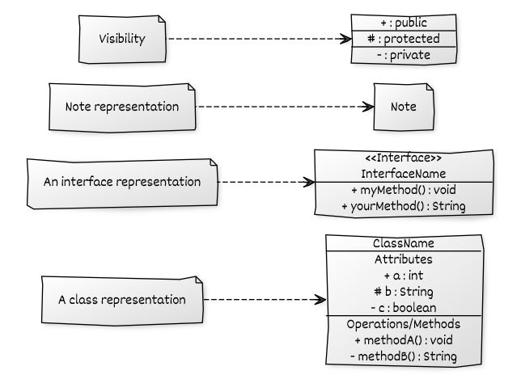

Back to [**Design Pattern**](README.md)
# Unified Modeling Language (UML)

* A standard language to document the software system diagrammatically.
* Created by Object Management Group(OMG) and purposed in 1997, January.
* OMG believes in this idiom, "A picture is worth a thousand words."

Note : Here we are just studying some basic thngs

## Notations

  

      

         

             
         

      

   

Back to [**Design Pattern**](README.md)
